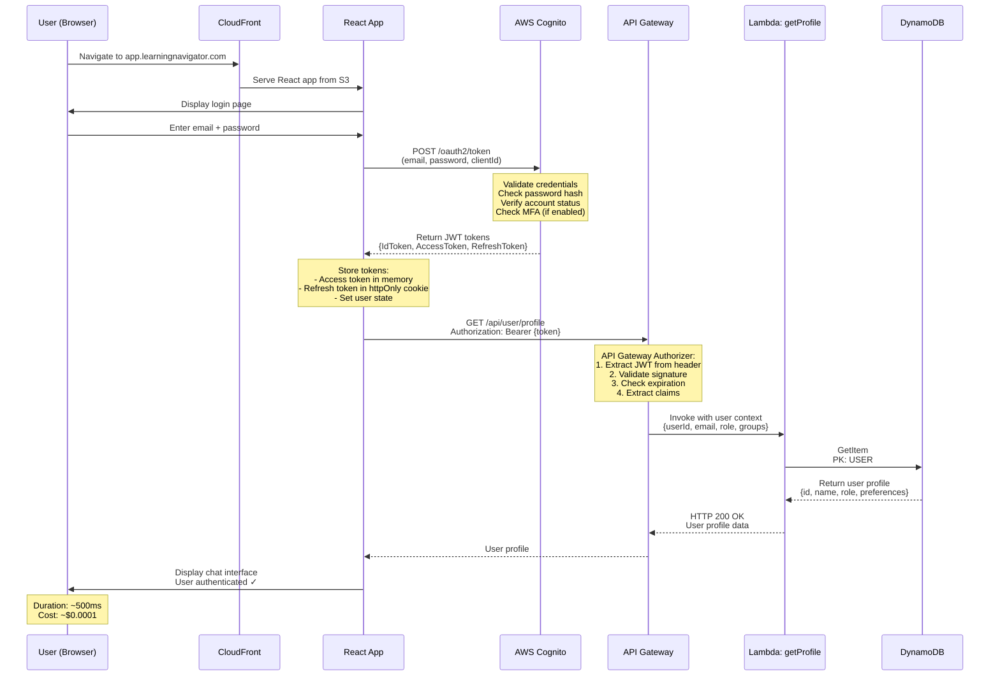
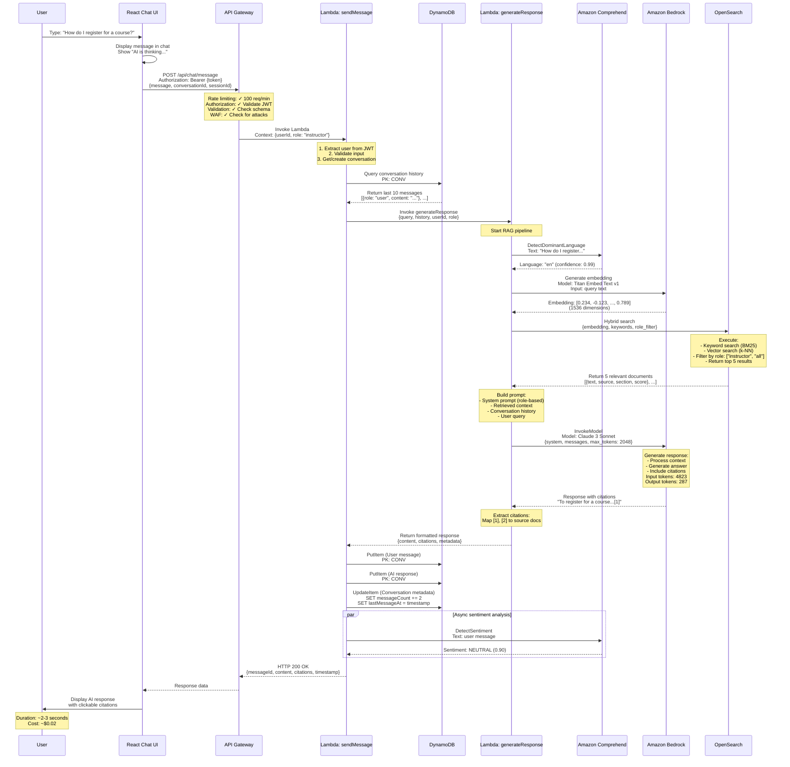
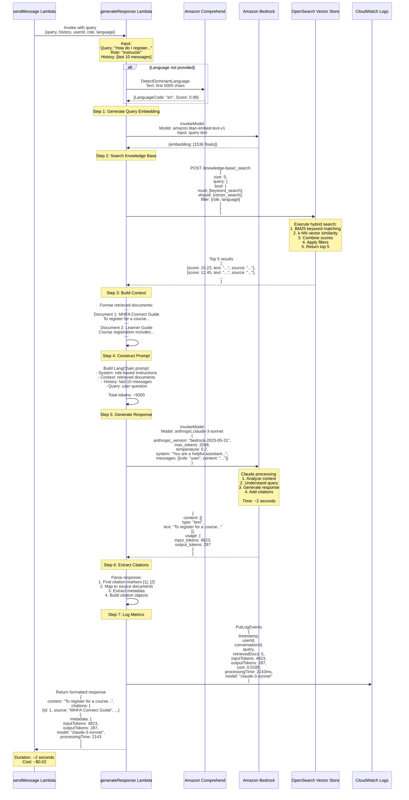
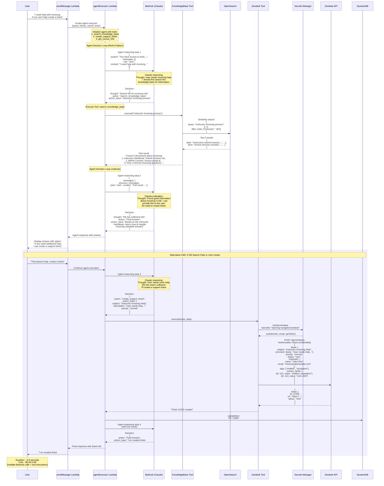
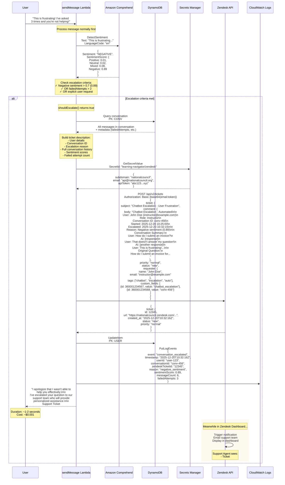
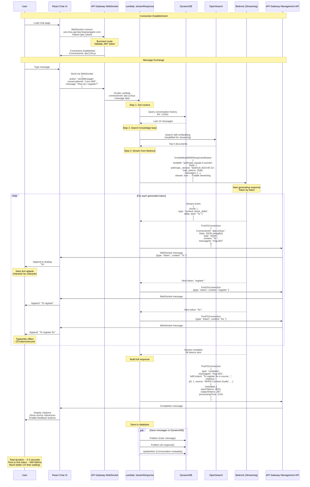
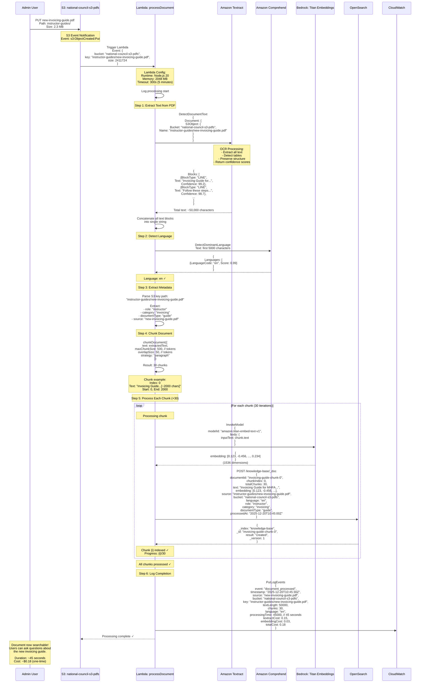

```mermaid
sequenceDiagram
    participant Admin as Admin User
    participant React as React Admin Dashboard
    participant APIGW as API Gateway
    participant Lambda as Lambda: getAnalytics
    participant DDB as DynamoDB
    participant CloudWatch as CloudWatch

    Admin->>React: Navigate to /admin/analytics
    React->>React: Check user role<br/>Verify "admins" group

    React->>APIGW: GET /api/admin/analytics<br/>?timeRange=last_30_days<br/>Authorization: Bearer {admin_token}

    Note over APIGW: Authorizer:<br/>1. Validate JWT ✓<br/>2. Check groups ✓<br/>3. Verify "admins" membership ✓<br/>4. Reject if not admin

    APIGW->>Lambda: Invoke with admin context<br/>{<br/>  userId: "admin-123",<br/>  role: "admin",<br/>  groups: ["admins"],<br/>  timeRange: "last_30_days"<br/>}

    Note over Lambda: Calculate date range:<br/>startDate = now - 30 days<br/>endDate = now

    Note over Lambda: Query 1: Conversation Metrics

    Lambda->>DDB: Query GSI1<br/>{<br/>  IndexName: "GSI1PK-GSI1SK-index",<br/>  KeyConditionExpression:<br/>    "GSI1PK BETWEEN :start AND :end",<br/>  ExpressionAttributeValues: {<br/>    ":start": "DATE#2025-11-20",<br/>    ":end": "DATE#2025-12-20"<br/>  }<br/>}

    DDB-->>Lambda: Conversations in range<br/>[{...}, {...}, ...] (1247 items)

    Lambda->>Lambda: Aggregate metrics:<br/>- totalConversations: 1247<br/>- totalMessages: 8935<br/>- avgMessagesPerConv: 7.16<br/>- activeUsers: 342<br/>- newUsers: 89

    Note over Lambda: Query 2: Sentiment Analysis

    Lambda->>Lambda: Process sentiment data<br/>from conversations:<br/><br/>For each conversation:<br/>  Count sentiment categories<br/>  Calculate avg satisfaction

    Lambda->>Lambda: Results:<br/>- positive: 734 (58.9%)<br/>- neutral: 423 (33.9%)<br/>- negative: 90 (7.2%)<br/>- avgSatisfaction: 4.2/5.0

    Note over Lambda: Query 3: Escalation Metrics

    Lambda->>DDB: Query escalated conversations<br/>{<br/>  FilterExpression: "escalated = :true",<br/>  ExpressionAttributeValues: {<br/>    ":true": true<br/>  }<br/>}

    DDB-->>Lambda: Escalated conversations (78 items)

    Lambda->>Lambda: Analyze escalations:<br/>- totalEscalations: 78<br/>- escalationRate: 6.25%<br/>- reasonBreakdown: {<br/>    negative_sentiment: 45,<br/>    repeated_failures: 21,<br/>    explicit_request: 12<br/>  }<br/>- avgTimeToEscalation: "4.3 min"

    Note over Lambda: Query 4: Performance Metrics

    Lambda->>CloudWatch: GetMetricStatistics<br/>{<br/>  Namespace: "AWS/Lambda",<br/>  MetricName: "Duration",<br/>  Dimensions: [{<br/>    Name: "FunctionName",<br/>    Value: "learning-navigator-*"<br/>  }],<br/>  StartTime: startDate,<br/>  EndTime: endDate,<br/>  Period: 3600,<br/>  Statistics: ["Average", "p95", "p99"]<br/>}

    CloudWatch-->>Lambda: Lambda performance data

    Lambda->>CloudWatch: GetMetricStatistics<br/>(API Gateway latency)
    CloudWatch-->>Lambda: API Gateway metrics

    Lambda->>CloudWatch: GetMetricStatistics<br/>(Error rates)
    CloudWatch-->>Lambda: Error rate data

    Lambda->>CloudWatch: GetMetricStatistics<br/>(Custom: Bedrock token usage)
    CloudWatch-->>Lambda: Token usage data

    Lambda->>Lambda: Calculate costs:<br/>- Bedrock tokens → cost<br/>- Lambda invocations → cost<br/>- Other services → cost<br/><br/>Total: $127.45 (Bedrock)<br/>       $412.33 (Total this month)

    Note over Lambda: Query 5: Top Topics

    Lambda->>Lambda: Analyze conversation content<br/>Extract common keywords/topics:<br/><br/>- "Course Registration": 234<br/>- "Invoicing": 187<br/>- "Certification": 156<br/>- "Platform Navigation": 143<br/>- "Course Materials": 89

    Note over Lambda: Compile Complete Response

    Lambda-->>APIGW: HTTP 200 OK<br/>{<br/>  period: {<br/>    start: "2025-11-20",<br/>    end: "2025-12-20",<br/>    days: 30<br/>  },<br/>  conversations: {<br/>    total: 1247,<br/>    totalMessages: 8935,<br/>    avgLength: 7.16,<br/>    dailyAvg: 41.6<br/>  },<br/>  users: {<br/>    active: 342,<br/>    new: 89,<br/>    retention: "73.2%"<br/>  },<br/>  sentiment: {<br/>    positive: 58.9,<br/>    neutral: 33.9,<br/>    negative: 7.2,<br/>    satisfaction: 4.2<br/>  },<br/>  escalations: {<br/>    total: 78,<br/>    rate: 6.25,<br/>    avgTimeToEscalation: "4.3 minutes"<br/>  },<br/>  performance: {<br/>    avgResponseTime: 2.3,<br/>    p95ResponseTime: 3.8,<br/>    errorRate: 0.8<br/>  },<br/>  costs: {<br/>    bedrock: 127.45,<br/>    total: 412.33<br/>  },<br/>  topTopics: [...]<br/>}

    APIGW-->>React: Analytics data

    React->>Admin: Render dashboard:<br/>- Conversation charts<br/>- Sentiment pie chart<br/>- Escalation trends<br/>- Performance graphs<br/>- Cost breakdown<br/>- Top topics list

    Note over Admin: Duration: ~1-2 seconds<br/>Cost: ~$0.001
```

# Learning Navigator - Sequence Diagrams

## Overview

This document provides detailed sequence diagrams for all major system flows using Mermaid syntax. These diagrams complement the user flows in [USER_FLOWS.md](USER_FLOWS.md) by showing the exact sequence of interactions between components.

---

## Table of Contents

1. [User Authentication Flow](#1-user-authentication-flow)
2. [Basic Chat Message Flow](#2-basic-chat-message-flow)
3. [RAG Response Generation Flow](#3-rag-response-generation-flow)
4. [Agent with Tools Flow](#4-agent-with-tools-flow)
5. [Escalation to Zendesk Flow](#5-escalation-to-zendesk-flow)
6. [Real-Time Streaming Flow](#6-real-time-streaming-flow)
7. [Document Processing Flow](#7-document-processing-flow)
8. [Admin Analytics Flow](#8-admin-analytics-flow)

---

## 1. User Authentication Flow

### Description
User logs in with email/password, receives JWT tokens, and loads their profile.

### Sequence Diagram

### Key Details
- **Duration**: ~500ms
- **Services**: CloudFront, S3, Cognito, API Gateway, Lambda, DynamoDB
- **Authentication**: JWT tokens with 1-hour expiry
- **Security**: TLS 1.3, httpOnly cookies, API Gateway authorizer

---

## 2. Basic Chat Message Flow

### Description
User sends a message, system retrieves history, generates AI response with RAG, saves conversation, and returns response with citations.

### Sequence Diagram

### Key Details
- **Duration**: ~2-3 seconds
- **Services**: API Gateway, Lambda (×2), DynamoDB, OpenSearch, Bedrock (×2), Comprehend (×2)
- **Cost per request**: ~$0.02
- **Parallel operations**: Sentiment analysis runs asynchronously

---

## 3. RAG Response Generation Flow

### Description
Detailed breakdown of the generateResponse Lambda function showing the complete RAG pipeline.

### Sequence Diagram

### Key Details
- **Duration**: ~2 seconds
- **Services**: Comprehend, Bedrock (×2 - embeddings + generation), OpenSearch, CloudWatch
- **Token usage**: ~4800 input, ~300 output
- **Cost**: ~$0.02 per response
- **Caching**: System prompts cached for 5 minutes

---

## 4. Agent with Tools Flow

### Description
Complex query requiring agent reasoning and tool execution (search knowledge base, create Zendesk ticket).

### Sequence Diagram

### Key Details
- **Duration**: ~4-5 seconds (multiple LLM calls)
- **Services**: Bedrock (×2-3 calls), OpenSearch, Zendesk API, Secrets Manager, DynamoDB
- **Cost per request**: ~$0.04-0.06
- **Pattern**: ReAct (Reasoning + Acting)
- **Tools**: 3 available (KB search, Zendesk, courses)

---

## 5. Escalation to Zendesk Flow

### Description
Automatic escalation triggered by negative sentiment detection or repeated failures.

### Sequence Diagram

### Key Details
- **Duration**: ~1-2 seconds
- **Services**: Comprehend, Secrets Manager, Zendesk API, DynamoDB, CloudWatch
- **Cost**: ~$0.001
- **Triggers**: Negative sentiment > 0.7, failed attempts > 2, explicit request
- **Context**: Full conversation history passed to support team

---

## 6. Real-Time Streaming Flow

### Description
WebSocket-based real-time streaming of AI response tokens for improved user experience.

### Sequence Diagram

### Key Details
- **Duration**: ~2-3 seconds (same as non-streaming)
- **Time to first token**: ~300-500ms
- **Benefits**: Improved perceived performance, better UX
- **Streaming rate**: ~20 tokens/second
- **Connection**: Persistent WebSocket connection
- **Services**: API Gateway WebSocket, Lambda, Bedrock (streaming), DynamoDB

---

## 7. Document Processing Flow

### Description
Background processing triggered when a PDF is uploaded to S3, extracting text, generating embeddings, and indexing.

### Sequence Diagram

### Key Details
- **Duration**: ~30-60 seconds per PDF (depends on size)
- **Services**: S3, Lambda, Textract, Comprehend, Bedrock (Titan), OpenSearch, CloudWatch
- **Processing**: Automatic on S3 upload
- **Cost**: ~$0.15-0.30 per document (one-time)
- **Chunking**: 500 tokens with 50 token overlap
- **Embeddings**: 1536-dimensional vectors

---

## 8. Admin Analytics Flow

### Description
Admin dashboard loading conversation metrics, sentiment analysis, escalation data, and performance metrics.

### Sequence Diagram

### Key Details
- **Duration**: ~1-2 seconds
- **Services**: API Gateway, Lambda, DynamoDB (with GSI), CloudWatch
- **Authorization**: Admin-only (verified via Cognito groups)
- **Cost**: ~$0.001 per request
- **Metrics**: Conversations, sentiment, escalations, performance, costs, topics
- **Time ranges**: Last 7 days, 30 days, 90 days, custom

---

## Summary Table

| Flow | Duration | Services | Complexity | Cost |
|------|----------|----------|------------|------|
| Authentication | ~500ms | CloudFront, Cognito, API Gateway, Lambda, DynamoDB | Low | $0.0001 |
| Basic Chat | ~2-3s | API Gateway, Lambda (×2), DynamoDB, OpenSearch, Bedrock (×2), Comprehend (×2) | Medium | $0.02 |
| RAG Generation | ~2s | Comprehend, Bedrock (×2), OpenSearch, CloudWatch | Medium | $0.02 |
| Agent with Tools | ~4-5s | Bedrock (×2-3), OpenSearch, Zendesk, Secrets Manager, DynamoDB | High | $0.04-0.06 |
| Escalation | ~1-2s | Comprehend, Secrets Manager, Zendesk, DynamoDB, CloudWatch | Low | $0.001 |
| Streaming | ~2-3s | WebSocket API, Lambda, Bedrock (streaming), DynamoDB | Medium | $0.02 |
| Document Processing | ~30-60s | S3, Lambda, Textract, Bedrock, OpenSearch, CloudWatch | High | $0.18 (one-time) |
| Admin Analytics | ~1-2s | API Gateway, Lambda, DynamoDB, CloudWatch | Medium | $0.001 |

---

## Notes on Diagrams

### Rendering
These sequence diagrams use **Mermaid syntax** which renders in:
- ✅ GitHub/GitLab
- ✅ VS Code (with Mermaid extension)
- ✅ Notion
- ✅ Many markdown viewers

### Conventions
- **Participant names**: Short, descriptive
- **Messages**: Include HTTP method, endpoint, and key parameters
- **Notes**: Provide context and calculations
- **Alt/Par blocks**: Show conditional flows and parallel operations
- **Timing**: Included in final notes for each flow

### Integration with USER_FLOWS.md
- **USER_FLOWS.md**: ASCII art showing complete system visualization
- **SEQUENCE_DIAGRAMS.md** (this file): Formal sequence diagrams with exact message flows
- Use both together for complete understanding

---

## Document Control

**Version**: 1.0
**Last Updated**: 2025-12-20
**Related Documents**:
- [USER_FLOWS.md](USER_FLOWS.md) - Complete user flow visualizations
- [AWS_ARCHITECTURE_DETAILED.md](AWS_ARCHITECTURE_DETAILED.md) - AWS service configurations
- [CODE_STANDARDS.md](CODE_STANDARDS.md) - Implementation standards

---

*These sequence diagrams provide the exact interaction flows needed for implementation and debugging.*
